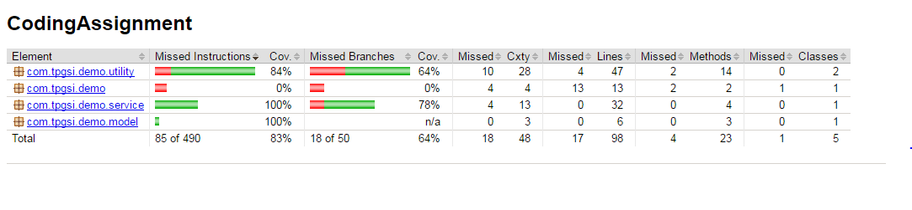

## Coding Assignment

A java application which can be used to get the list of categories and its subcategories with its appropriate counts.

### Algorithm 

* Read data from file
* Process the file to get the category and subcategory
* Remove if any duplicate category, subcategory from the file and store in a list
* Iterate the list to create an object would contain category and subcategory
* Create a category enum with the required category with their default values i.e. 0
* Iterate the category list to count the valid categories and store in a map
* Print the count first using the map and then the list of categories and its subcategories


### Required 

* Java 1.8
* Gradle 

### Libraries

* JUnit 4.+
* jacoco 0.7.6

### Running the project

This project can be run in 2 ways.

1) Using an IDE 

	Import the project into Eclipse IDE and run the AssignmentDemo.java as a java application. It requires an argument to be passed. i.e. an absolute path to a text file.
     
     
2) Using Gradle build

	Clone the git path, and run the gradle command
```
   gradle clean test build        
```

After bulding the project, we will get a jar file which will be located in the build/libs folder. Run it using the below command

```
   java -jar CodingAssignment.jar 'absolute path to file'
   eg : java -jar CodingAssignment.jar /home/akshay/inputfile.txt
```

### Input

* PERSON Bob Jones
* PLACE Washington
* PERSON Mary
* COMPUTER Mac
* PERSON Bob Jones
* OTHER Tree
* ANIMAL Dog
* PLACE Texas
* FOOD Steak
* ANIMAL Cat


### Output

Category Count </br>
PERSON 2</br>
PLACE 2</br>
ANIMAL 2</br>
COMPUTER 1</br>
OTHER 1</br>

PERSON Bob Jones</br>
PLACE Washington</br>
PERSON Mary</br>
COMPUTER Mac</br>
OTHER Tree</br>
ANIMAL Dog</br>
PLACE Texas</br>
ANIMAL Cat</br>

### Code Coverage

This report can be obtained by running the below gradle command

```
   gradle clean test jacocoTestReport
```


